# Xworm - Malware Analysis

**File Information:**
- **SHA-256:** `35ec891563481e0e104c5d96c7bbd8294691f931ef178ffc1693cac1151261ae`
- **MD5:** `ae3f957f092891325bafde498a35e10b`
- **File name:** `WdToolFix.exe`

---

## Key Takeaways
**Objective** : Sending payload and getting sentitive data from user.

**Key Finding** : 
* Socket : Connect to IP : 192.0.2.123 & Port: 46865
* Keylogger : Listen to user pressing keyboard.
* Stealing Information : All the computer components

**Risks/Points to note :** 
* Malware would create HKey which automatically execute whenever user login if you ran on Administrator
* Reload terminal one time per minutes.


## Case Summary

This analyst was written on 26/09/2025 when the user dowloaded and executed successfully. 

Firstly, the malware will take some available data to decrypt them and store in a few variables. Next time, it get the directory and install an application being a fake hidden PIF file. That file run to create a powershell and loop one time per minute.

Secondly, It creates a HKEY that would set schedule and automatically execute upon user logon. Additionally, there is a KeyLogger function which strives to get the key event that user type in.

Lastly, that threat program call Socket API to connect to supicious IP and send all the hardware and software information to threat actor.
## Analyst

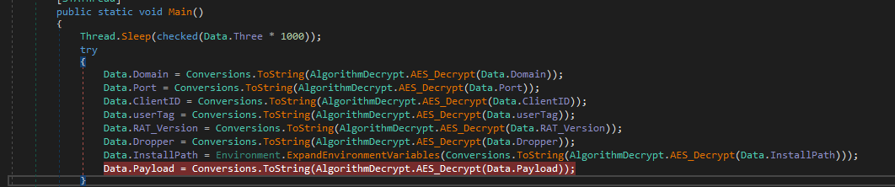


Firstly, this program was going to decrypt all the encrypted data and we gained plenty of information that the malware might do, I will make a bief list.


> Domain : bore.pub
> Port : 46865
> userID : <123456789>
> userTag: <Xrommmmm>
> Version : LOLRat 1.0 XEdition
> Dropper : USB.exe
> InstallPath : C:\ProgramData
> Payload : videodata_mp4.pif

    
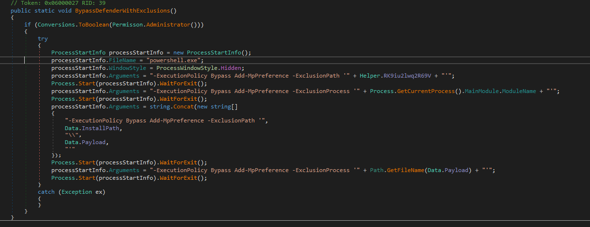

    
    
Next, I found an interesting function. It requests Administrator permission, and its purpose is to disable Windows Defender for itself and the payload, thus helping it remain alive for a long time.
    
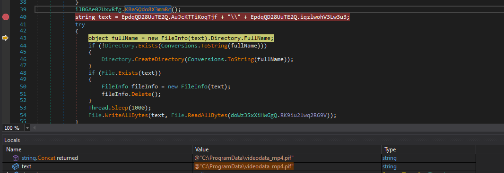

In text variable, It was calling concatenation to get the directory path which is `"@C:\ProgramData\videodata_mp4.pif"` 
    
Then, this path is used to create the payload in victim's machine starting at the `WriteAllBytes` function

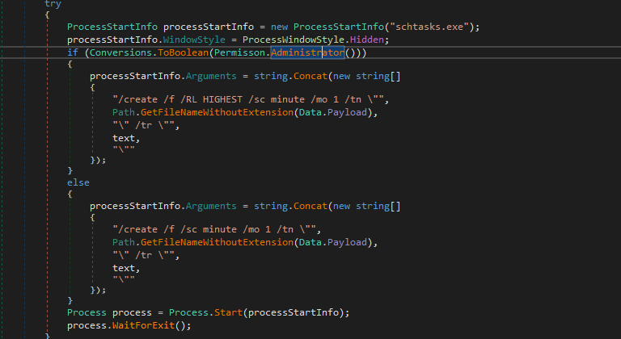

Additionally, this program will build a `processStartInfo` function with 
'schtasks.exe' parameter being a hidden process.
    
As you saw, there is a control flow intruction but is has a same target to create the Scheduled Task to run payload one minutes per time. However, if you ran with Administator permission, it would do by highest permission.

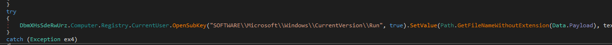

Next, the malicous code create a Registry key which is `"SOFTWARE\\Microsoft\\Windows\\CurrentVersion\\Run"`, use Run or RunOnce registry keys to make a program run when a user logs on. The Run key makes the program run every time the user logs on, while the RunOnce key makes the program run one time, and then the key is deleted. These keys can be set for the user or the machine.
    
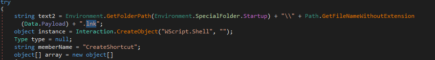

This program would create a .lnk file and actually create a file at Startup which run whenever the user login.
    
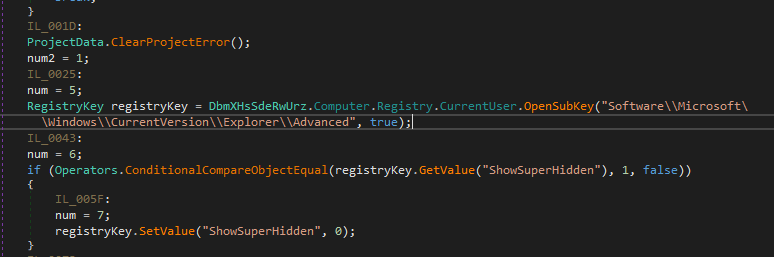

Futhermore, It creates a hidden file through the `"Software\\Microsoft\\Windows\\CurrentVersion\\Explorer\\Advanced"  ` directory. 
    
    
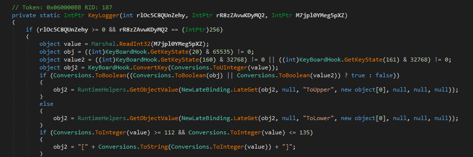

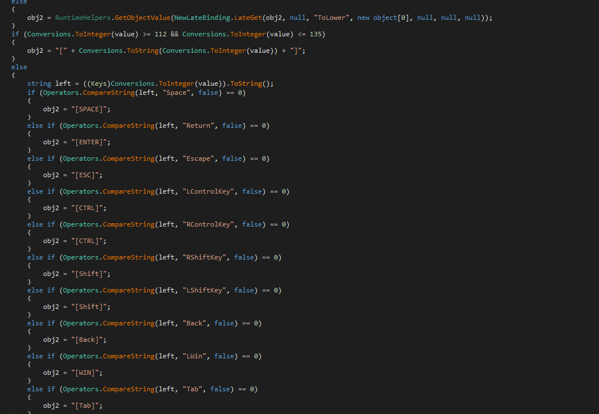

Then, Malware have created a low-level keyboard hook (keylogger). Eachtime the user presses a key, Windows invokes the `KeyLogger` callback. It reads the key code, check modifier states such as CapsLock, Shift,... After converting it into string, the function would resolve some speacial key like `ENTER & SPACE`. Last, all of keyboard log must be exfiltrated to the attacker, thus leading to get the sentitive data.
    
    
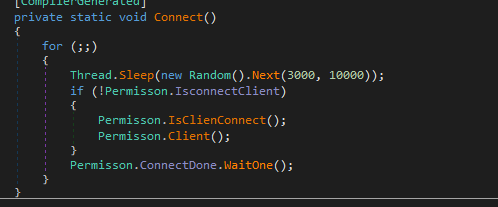

Last but not least, the malware will connect to the attacker's server by `Socket API`, which is the common function used to send & receive data.
    
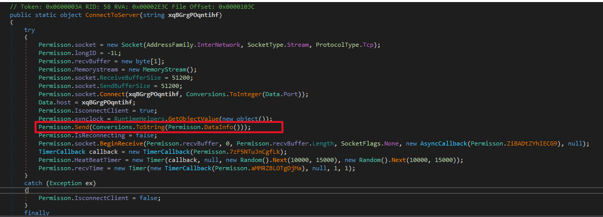

I have founded the crucial function named `"Send"`, it is one of the Socket API component which target is to steal all the victim's information and send the threat actor.
    
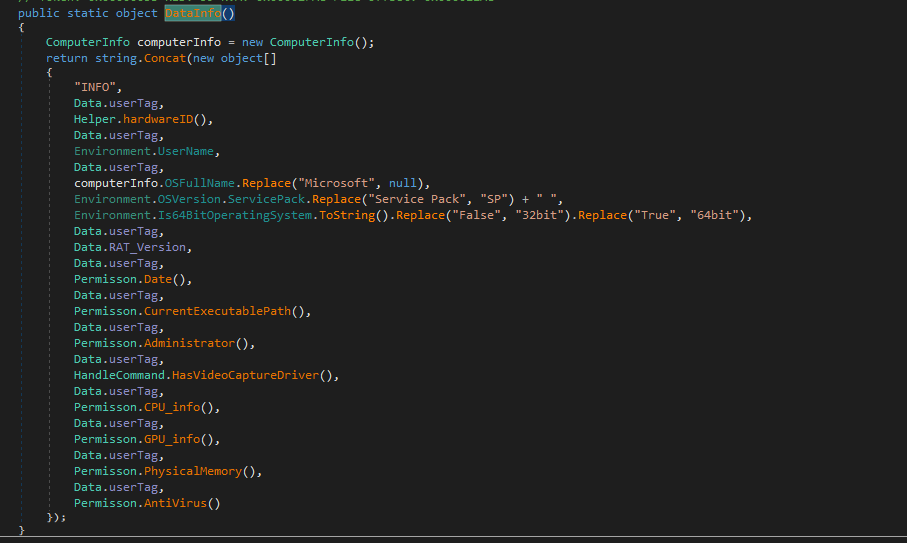

Well, I have research the `DataInfo()` function. It will strive to steal some information, specifically the `hardwareID()` including : 
    
```
ProcessorCount
UserName
MachineName
OSVersion
```
    
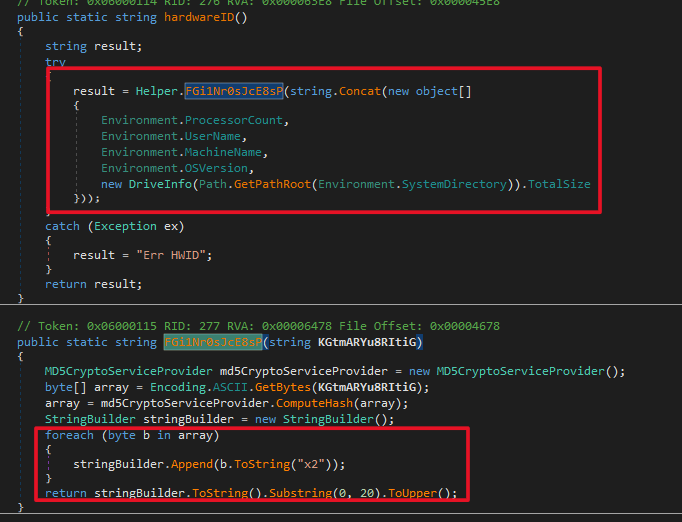

Ther are all hashed by MD5, append "x2" with everybytes in that array and cut 20 bytes first to send.
    
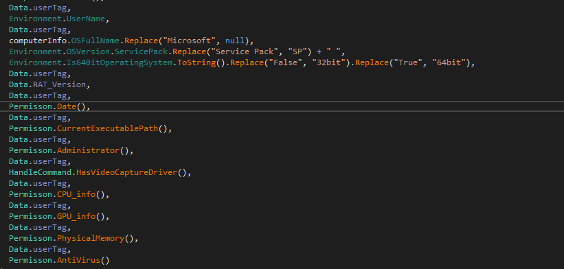

By the way, that program will take all data which released all the hardware and some of software infomation.
    
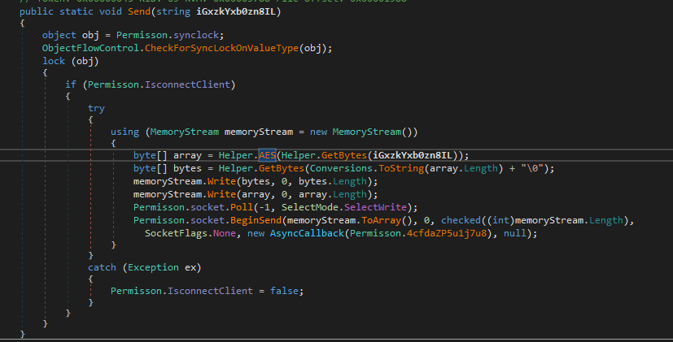

Alright, overall, The data would be encrypted by AES algorith and send the server all of information that it got in advance.
    

With network analyst, I have found something interested like it actually connect to `"bore.pub"` (C2 Domain) and try to send a bytecode to the server.
    
    
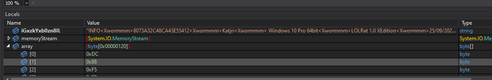
    
> "INFO<Xwormmm>8073A32C48CA43E55412<Xwormmm>Katjri<Xwormmm> Windows 10 Pro 64bit<Xwormmm>LOLRat 1.0 XEdition<Xwormmm>25/09/2025<Xwormmm>False<Xwormmm>False<Xwormmm>False<Xwormmm>Intel  i5-8300H  @ 2.30GHz<Xwormmm>VirtualBox Graphics Adapter (WDDM) <Xwormmm>7.99 GB<Xwormmm>Windows Defender"
> 
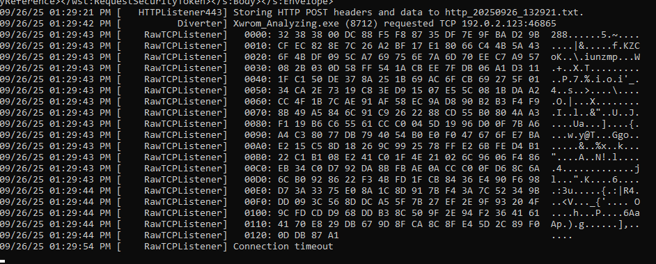

Next, in the `Send` function, it will call AES_ECB to encrypt with the hashed key which is `userID` and BeginSend the hexcode.
    
With three bytes first, they are length of payload and 00 is "\0" (null) which are injected before sending.
    
    

